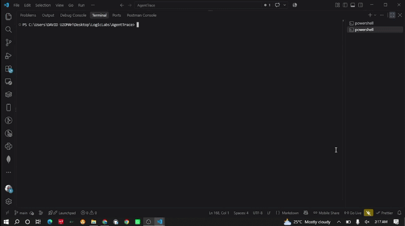

# AgentTrace


## See what your AI coding agents actually do.

That is the destination. AgentTrace is being built to detect every running coding agent on your machine, separate their processes, and trace their activity.

```powershell
npm install -g @coachlogic/agenttrace
agenttrace run
```



Phase 3's portable trace-recorder milestone is complete. This focused update improves the existing event timeline, check recording, timestamp presentation, JSON output, and history readability. AgentTrace can take a process snapshot, poll running agent process trees into JSONL history, or launch a command under supervision and record its process lifecycle, observed descendants, streams, and optionally changed workspace files.

## Current status

Snapshot mode takes a one-time process snapshot, builds parent-child relationships, and assigns each observed descendant to its nearest detected agent process. Each agent process has an independent trace ID derived from its PID and start time, so same-agent instances stay separate even when they share a working directory.

`watch` polls agent process trees and appends discovery, metadata-change, and no-longer-observed events to `.agenttrace/history.jsonl`. Polling can miss short-lived processes and cannot establish their exit codes. `trace` launches a command, forwards stdin/stdout/stderr, and records process start/end times, exact exit status when available, and stream byte counts. It also polls observed descendants every 250 ms; short-lived children can be missed and their exit status is unavailable. Each new JSONL event includes a local-offset ISO 8601 `timestamp` plus the existing Unix-millisecond fields for compatibility. Supervised sessions also use their session ID as the execution `cycle_id`. These are recorder/process boundaries, not internal AI conversation or tool-call cycles.

Stream contents and raw command arguments are omitted unless explicitly enabled. `--capture-streams` stores up to 10 MiB per stream as hex, without redaction; captured data can contain credentials or private source. Supervised `trace` applies only to the launched command and observed descendants; it cannot collect arbitrary processes' streams. `--watch-files` opts into polling file metadata under the command working directory and reports created, modified, and deleted paths. It skips `.git`, `.agenttrace`, `node_modules`, `target`, and `.venv`, scans at most 10,000 files, and can miss transient changes. It does not establish that a process opened or read a file, and path names may be sensitive. File contents and exact file reads/opens are not collected. This is not kernel-level system monitoring.

`trace --check` explicitly treats the launched command as a check and records `check.started` and `check.completed` as structured events with top-level `type`, `command`, `requested_by`, `pid`, timestamps, duration, and exit code. Command arguments are included in the check command only when `--include-command-args` is enabled, since arguments can contain secrets. Without `--check`, AgentTrace does not guess whether a command is a test or validation step. Checks record execution facts only; they do not judge task success.

For process discovery, command arguments are inspected in memory for detection but are not printed or persisted by default.

## Requirements

- Rust stable and Cargo
- On Windows, the Rust MSVC toolchain and its Visual Studio C++ build tools

## Run locally

```powershell
cargo run -- run
```

Omitting `run` takes the same discovery snapshot. Start an agent first, leave it running, then launch this command in another terminal to see whether it is detected.

Record and stream process-observation events until Ctrl+C, then inspect the JSONL history:

```powershell
cargo run -- watch
cargo run -- watch --json
cargo run -- watch --pretty-json
cargo run -- run --watch
cargo run -- history
cargo run -- history --json
cargo run -- history --pretty-json
```

Watch shows an agent summary and a color-coded live process table, then prints timestamped process changes. Use `--json` (or `--format json`) for compact JSONL on stdout: one complete JSON object per line without ANSI styling, suitable for pipes. Use `--pretty-json` (or `--format pretty-json`) for an indented initial agent summary with live processes, followed by indented JSON event records for changes; this is not JSONL. The `.agenttrace/history.jsonl` file always remains compact JSONL; each event's `session_id` identifies one watch run, and process events' `trace_id` groups an agent and its observed descendants. Use `--duration-ms 10000` for a bounded 10-second session, `--interval-ms 500` to change the polling interval, or `--output PATH` to select another history file. `--include-command-args` records raw process arguments verbatim; they may contain secrets.

`agenttrace history` renders JSONL as a readable local-time timeline with distinct event and process-role colors. Use `agenttrace history --json` to print the original JSONL unchanged for scripts and pipes, or `agenttrace history --pretty-json` to inspect indented records. JSON modes intentionally do not use terminal colors.

Launch and trace a command, preserving its exit code and forwarding its standard streams:

```powershell
cargo run -- trace --output .agenttrace/command.jsonl -- PROGRAM ARG1 ARG2
cargo run -- trace --check --include-command-args --output .agenttrace/check.jsonl -- npm test
```

For example, on Windows use `cargo run -- trace --check --include-command-args -- powershell -NoProfile -Command "Write-Output hello; exit 7"`; on macOS/Linux use `cargo run -- trace --check --include-command-args -- sh -c "echo hello; exit 7"`. AgentTrace returns the child exit code. Add `--watch-files` before `--` to detect workspace file metadata changes, `--capture-streams` to record raw stream bytes, or `--include-command-args` to persist arguments. Each may expose sensitive data. `--cwd PATH` sets the command working directory.

## Test

```powershell
cargo test
```

The tests cover agent classification, separate same-agent traces, nearest-ancestor attribution, process polling, readable/JSON history, timestamp rendering, check lifecycle data, supervised descendant attribution, workspace file-delta events, option parsing, and stream-byte encoding. File events remain workspace metadata deltas only; system-wide file-open/read monitoring is not included.

## Development commands

Node.js 18 or newer and Rust stable/Cargo are needed for development. End users installing the published npm package do not need Rust: the package contains prebuilt binaries for each published target.

```powershell
npm.cmd run build
npm.cmd run build:release
npm.cmd test
npm.cmd run pack
```

`npm run pack` builds and packages only the current machine's binary for local testing. It is not the cross-platform release package. The authoritative package is assembled in GitHub Actions from all successful platform builds.

## Release platforms

The release workflow attempts native build-and-test jobs for:

| npm platform | Rust target | CI runner |
| --- | --- | --- |
| Windows x64 | `x86_64-pc-windows-msvc` | `windows-2025` |
| Windows ARM64 | `aarch64-pc-windows-msvc` | `windows-11-arm` |
| macOS x64 | `x86_64-apple-darwin` | `macos-15-intel` |
| macOS ARM64 | `aarch64-apple-darwin` | `macos-15` |
| Linux x64 | `x86_64-unknown-linux-gnu` | `ubuntu-22.04` |
| Linux ARM64 | `aarch64-unknown-linux-gnu` | `ubuntu-22.04-arm` |

These are configured targets, not a claim that every target has already passed. A tag produces no release or npm publish unless every native runner builds and tests its target. Linux binaries are built on Ubuntu 22.04 and require a compatible glibc system. Verify the resulting release workflow before describing a target as supported.

## Create a release

Keep versions in `Cargo.toml`, `Cargo.lock`, and `package.json` in sync before tagging. The tag must match the package versions exactly (for example, version `0.1.9` uses tag `v0.1.9`). After review and commit, push the branch and tag:

```powershell
git push origin main
git tag vX.Y.Z
git push origin vX.Y.Z
```

The tag is the release source of truth. GitHub Actions rejects malformed tags and any mismatch with either package version, then runs the six native tests/builds. If all pass, it stages and verifies the npm package, creates or reuses the GitHub Release, uploads the six binaries plus `SHA256SUMS` and the npm tarball, and publishes `@coachlogic/agenttrace` with provenance. Release uploads replace assets on retry; an already-published npm version is not published twice.

### npm trusted publishing setup

No npm token is stored in this repository or required by the release workflow. Configure npm Trusted Publishing for package `@coachlogic/agenttrace` with GitHub owner `VeloraTech`, repository `AgentTrace`, workflow filename `release.yml`, and permission to publish. The workflow requests only GitHub's short-lived OIDC token (`id-token: write`). npm requires Node.js 22.14+ and npm 11.5.1+ for trusted publishing; the publish job installs Node.js 24 and a compatible npm CLI.

npm blocked the unscoped `agenttrace` name as too similar to an existing package, so npm uses `@coachlogic/agenttrace` while the CLI command remains `agenttrace`. If this is the first publish of the scoped package, npm requires one initial publish before Trusted Publishing can be configured: publish the release tarball once with `npm publish --access public <tarball>`, configure OIDC for `@coachlogic/agenttrace`, then rerun that release workflow. For subsequent releases, the workflow publishes the package with provenance. Do not force-move existing version tags.

For a project-local install, run the CLI through npm so its local `node_modules/.bin` directory is on `PATH`:

```bash
npm install @coachlogic/agenttrace
npm exec -- agenttrace run
```

For a global install, the command is available directly in the terminal:

```bash
npm install -g @coachlogic/agenttrace
agenttrace run
```

AgentTrace exposes the `agenttrace` executable through npm's `bin` field. It does not modify the consuming project's `package.json` to add scripts; if you want an `npm run` shortcut, add one in that project yourself, for example: `"agenttrace": "agenttrace run"`.

## crates.io source package

The Rust source crate remains separately publishable as `agenttrace-cli`:

```powershell
cargo test --locked
cargo package --list --allow-dirty
cargo package --allow-dirty
```

For the version in `Cargo.toml`, this creates the matching crate in `target\package`. crates.io publication is separate from the GitHub/npm release workflow.

## Clean generated files

Preview the cleanup:

```powershell
.\clean.ps1 -WhatIf
```

Remove generated build and release output:

```powershell
.\clean.ps1
```

The script removes only the project's `target` and `dist` directories. It keeps source files, `Cargo.lock`, documentation, and local AgentTrace data.

## Supported agent detectors

- Claude Code (`claude` or Claude Code package markers)
- Codex (`codex` or Codex package markers)
- Gemini CLI (`gemini` or Gemini CLI package markers)

Detection rules may need updates as agents change their packaging or executable names.
